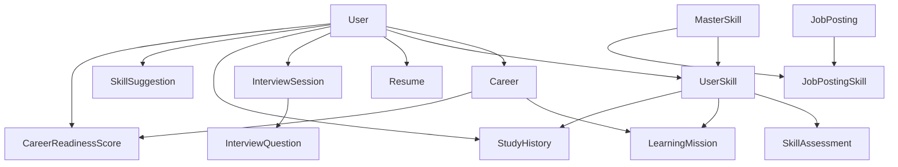

# 🤖 AI Career Mentor

> AI-powered career development platform built with **OutSystems Developer Cloud (ODC)**

AI Career Mentor is a career coaching platform that helps users improve their career readiness through AI-driven skill tracking, learning management, resume optimization, interview preparation, and job matching.

The goal of this project is to provide personalized career guidance by combining structured career data with AI-powered recommendations.

## 🇰🇷 한국어 소개

AI Career Mentor는 AI 기반 커리어 관리 플랫폼입니다.

사용자가 자신의 커리어 목표를 설정하고 현재 보유한 기술과 목표 기술을 관리하며, 학습 미션, 면접 준비, 이력서 관리까지 하나의 플랫폼에서 진행할 수 있도록 개발했습니다.

데이터 모델은 MasterSkill과 UserSkill을 분리하여 정규화했고, Career, LearningMission, StudyHistory, InterviewSession 등을 연결하여 커리어 성장 과정을 하나의 흐름으로 관리하도록 설계했습니다.

Dashboard에서는 Career Readiness와 학습 현황을 시각화하여 사용자가 현재 상태를 쉽게 파악할 수 있도록 했으며, 향후에는 OpenAI API를 연동하여 AI가 학습 방향과 커리어를 추천하는 기능까지 확장할 계획입니다.
---
## 🚀 Highlights

- 🤖 AI-powered Career Development Platform
- ☁️ Built with OutSystems Developer Cloud (ODC)
- 📊 Career Analytics Dashboard
- 🎯 Personalized Learning Missions
- 💼 Job Matching System
- 📄 Resume Management
- 🎤 Interview Preparation
- 🔐 Role-based Authorization
  
---

# 📌 Features

## 🏠 AI Career Dashboard
- Career Readiness overview
- Learning progress
- Resume status
- Career analytics
- AI career insights

---

## 🎯 Career Goal Management
- Create career goals
- Track target careers
- Set target dates
- Manage career progress

---

## 💪 My Skills
- Manage personal skills
- Current Level / Target Level
- Years of experience
- Self-assessment score
- Target skill management

---

## 📚 Learning Missions
- Create personalized learning missions
- Track mission progress
- Completion status
- Career-linked learning plans

---

## 📄 Resume Management
- Resume version management
- Resume optimization status
- AI feedback records
- Resume history

---

## 🎤 Interview Management
- Mock interview sessions
- Interview scores
- Performance tracking
- Interview history

---

## 📈 Career Readiness
- Career readiness tracking
- Progress history
- Readiness evaluation
- Career analytics

---

## 💼 Job Matching
- Job posting management
- Skill-based job matching
- Career opportunity tracking

---

## 📊 Study History
- Learning activity records
- Study duration
- Learning progress
- Study analytics

---

# 🔄 Application Workflow

Career Goal
      ↓
User Skills
      ↓
Skill Assessment
      ↓
Learning Missions
      ↓
Study History
      ↓
Interview Sessions
      ↓
Resume Optimization
      ↓
Career Readiness
      ↓
AI Recommendation
      ↓
Job Matching

---
# 🤖 AI Features

The application is designed around AI-assisted career coaching.

AI capabilities include:

- Personalized career recommendations
- Skill gap analysis
- Career readiness evaluation
- Learning mission suggestions
- Resume optimization support
- Interview performance analysis
- Job matching support

---

# 🗂 Data Model

Main Entities

- User
- Career
- UserSkill
- MasterSkill
- LearningMission
- StudyHistory
- Resume
- InterviewSession
- InterviewQuestion
- SkillAssessment
- CareerReadinessScore
- JobPosting
- JobPostingSkill
- SkillSuggestion

Static Entities

- CareerType
- SkillCategory
- SkillLevel
- AssessmentType
- DifficultyLevel
- SuggestionStatus

## 🏗 Project Architecture

---

# 📱 Main Screens

- Dashboard
  

- Careers
  

- My Skills
  

- Learning Missions
  

- Resume
  

- Study History
  

- Interview Sessions
  

- Skill Assessments
  

- Career Readiness
  

- Job Postings
  

- Career Analytics
  

---

# 🔐 Permissions

Role-based authorization

- Admin
- User

  
  

Users can only manage their own career data while administrators have full access.

---

# 🛠 Tech Stack

- OutSystems Developer Cloud (ODC)
- AI Mentor
- Reactive Web Application
- Entity Relationships
- Aggregates
- Role-Based Security
- Dashboard
- Charts
- CRUD Operations

---

# 🎯 Project Goals

This project was developed to demonstrate how AI can support career development by helping users:

- Understand their current skills
- Set career goals
- Improve interview performance
- Manage resumes
- Track learning progress
- Prepare for future jobs

---

# 🚀 Future Improvements

- OpenAI API Integration
- LLM-powered Career Advisor
- Resume AI Analysis
- Interview Voice Evaluation
- Personalized Learning Roadmaps
- Real-time Job Matching
- AI Chat Career Assistant

---

# 📸 Screenshots

Dashboard

Career Management

My Skills

Learning Missions

Resume Management

Interview Sessions

Career Analytics

Job Matching

---

# 👨‍💻 Author

Developed by **Jongmin Kang**

OutSystems Developer Cloud Project

AI-powered Career Development Platform

## 🌐 Live Demo

You can explore the application here:

https://personal-uueb45n0-dev.outsystems.app/CareerPathAI
